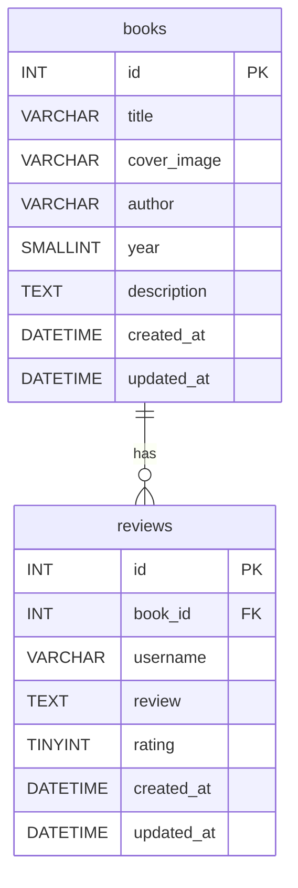

# App Books review

Un’app di `libri` in cui si potranno lasciare `recensioni` pubbliche.

## Database

Name: `13_pt_books_review_api`

**Tables:**

- `books` - contiene i libri con le relative informazioni (title, author, year, description, ecc.)
- `reviews` - contiene le recensioni dei libri, con riferimento al libro recensito.

Table `books`:

- id INT PRIMARY KEY AUTO_INCREMENT UNIQUE NOT NULL
- title VARCHAR(255) NOT NULL
- cover_image VARCHAR(255) NULL
- author VARCHAR(255) NOT NULL
- year SMALLINT NULL
- description TEXT NULL
- created_at DATETIME DEFAULT CURRENT_TIMESTAMP
- updated_at DATETIME DEFAULT CURRENT_TIMESTAMP ON UPDATE CURRENT_TIMESTAMP

Table: `reviews`:

- id INT PRIMARY KEY AUTO_INCREMENT UNIQUE NOT NULL
- book_id INT NOT NULL
- username VARCHAR(255) NULL DEFAULT 'Anonymous'
- review TEXT NOT NULL
- rating TINYINT NOT NULL
- created_at DATETIME DEFAULT CURRENT_TIMESTAMP
- updated_at DATETIME DEFAULT CURRENT_TIMESTAMP ON UPDATE CURRENT_TIMESTAMP

## ER Diagram



## SQL Queries

### Create Database

```sql
CREATE DATABASE IF NOT EXISTS `13_pt_books_review_api`;
```

### Create Tables

```sql
USE `13_pt_books_review_api`;

CREATE TABLE IF NOT EXISTS `books` (
    `id` INT PRIMARY KEY AUTO_INCREMENT UNIQUE NOT NULL,
    `title` VARCHAR(255) NOT NULL,
    `cover_image` VARCHAR(255) NULL,
    `author` VARCHAR(255) NOT NULL,
    `year` SMALLINT NULL,
    `description` TEXT NULL,
    `created_at` DATETIME DEFAULT CURRENT_TIMESTAMP,
    `updated_at` DATETIME DEFAULT CURRENT_TIMESTAMP ON UPDATE CURRENT_TIMESTAMP
);

CREATE TABLE IF NOT EXISTS `reviews` (
    `id` INT PRIMARY KEY AUTO_INCREMENT UNIQUE NOT NULL,
    `book_id` INT NOT NULL,
    `username` VARCHAR(255) NULL DEFAULT 'Anonymous',
    `review` TEXT NOT NULL,
    `rating` TINYINT NOT NULL,
    `created_at` DATETIME DEFAULT CURRENT_TIMESTAMP,
    `updated_at` DATETIME DEFAULT CURRENT_TIMESTAMP ON UPDATE CURRENT_TIMESTAMP,
    FOREIGN KEY (`book_id`) REFERENCES `books`(`id`) ON DELETE CASCADE
);
```

### Fix Column Type (if already created with `YEAR`)

```sql
USE `13_pt_books_review_api`;

ALTER TABLE `books` MODIFY COLUMN `year` SMALLINT NULL;
```

### Seed Data

```sql
USE `13_pt_books_review_api`;

INSERT INTO `books` (`title`, `cover_image`, `author`, `year`, `description`) VALUES
('Il nome della rosa', 'https://placehold.co/600x400?text=Il+nome+della+rosa', 'Umberto Eco', 1980, 'Un monastero medievale, un misterioso omicidio, un frate francescano che indaga tra enigmi e segreti nascosti tra le mura di una biblioteca inaccessibile.'),
('1984', 'https://placehold.co/600x400?text=1984', 'George Orwell', 1949, 'Un inquietante ritratto di un futuro totalitario dove il Grande Fratello osserva ogni mossa e la libertà di pensiero è il crimine più grave.'),
('Orgoglio e pregiudizio', 'https://placehold.co/600x400?text=Orgoglio+e+pregiudizio', 'Jane Austen', 1813, 'Nell\'Inghilterra georgiana, Elizabeth Bennet e il Signor Darcy si sfidano tra pregiudizi e orgoglio in una delle storie d\'amore più celebri della letteratura.'),
('Cent\'anni di solitudine', 'https://placehold.co/600x400?text=Cent\'anni+di+solitudine', 'Gabriel García Márquez', 1967, 'La saga della famiglia Buendía a Macondo, un luogo magico dove la realtà si mescola al fantastico in un capolavoro del realismo magico.'),
('Il giovane Holden', 'https://placehold.co/600x400?text=Il+giovane+Holden', 'J.D. Salinger', 1951, 'Holden Caulfield, adolescente ribelle e disilluso, vaga per New York dopo essere stato espulso dal college, cercando un senso in un mondo che giudica ipocrita.');

INSERT INTO `reviews` (`book_id`, `username`, `review`, `rating`) VALUES
(1, 'Michele', 'Un capolavoro assoluto. Eco intreccia storia, filosofia e giallo in modo magistrale. La biblioteca labirintica è uno dei luoghi letterari più affascinanti mai scritti.', 5),
(1, 'Sofia', 'Bellissimo ma molto denso. Alcune parti in latino e le lunghe digressioni teologiche possono risultare pesanti, ma ne vale assolutamente la pena.', 4),
(2, 'Lorenzo', 'Orwell aveva una visione spaventosamente profetica. Un libro che tutti dovrebbero leggere almeno una volta nella vita. Ancora oggi incredibilmente attuale.', 5),
(2, 'Martina', 'Angosciante e necessario. La descrizione del controllo mentale e della manipolazione della verità è agghiacciante. Non l\'ho trovato una lettura facile, ma è potentissimo.', 4),
(3, 'Anna', 'Jane Austen è semplicemente geniale. I dialoghi tra Elizabeth e Darcy sono scintillanti. Un romanzo che migliora a ogni rilettura.', 5),
(3, 'Marco', 'Non è il mio genere, ma devo riconoscere la qualità della scrittura. I personaggi sono ben costruiti e la satira sociale è ancora attuale.', 3),
(4, 'Elena', 'Un\'opera magica e travolgente. García Márquez crea un mondo unico dove tutto è possibile. Ogni pagina è una sorpresa, ogni personaggio indimenticabile.', 5),
(4, 'Paolo', 'Ho faticato all\'inizio, ma una volta entrato nel ritmo della prosa di Márquez sono rimasto incantato. Un viaggio letterario straordinario.', 4),
(5, 'Chiara', 'Holden è uno dei personaggi più autentici della letteratura. La sua voce è cruda, sincera e tremendamente umana. Un libro che parla direttamente al cuore degli adolescenti.', 5),
(5, 'Matteo', 'Posso capire perché piace ma non mi ha entusiasmato. Holden a volte è insopportabile, anche se forse questo è proprio il punto. Scrittura comunque efficace.', 3);

```

#### API Endpoints
- GET /api/v1/books - Ottieni tutti i libri
- GET /api/v1/books/:id - Ottieni un libro specifico per ID
- POST /api/v1/books - Aggiungi un nuovo libro
- POST /api/v1/books/:id/reviews - Aggiungi una recensione a un libro specifico

**Payload review:**
```json
{
  "username": "NomeUtente",
    "review": "Testo della recensione",
    "rating": 5
}

## setup server express

`
